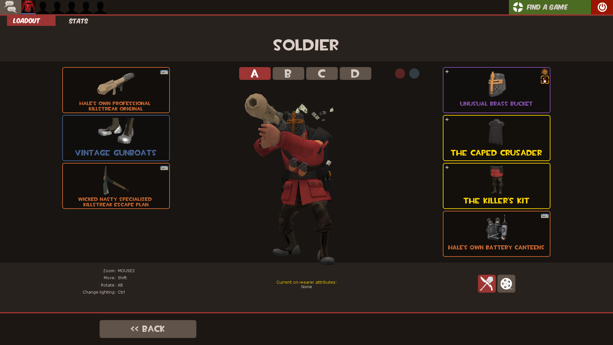
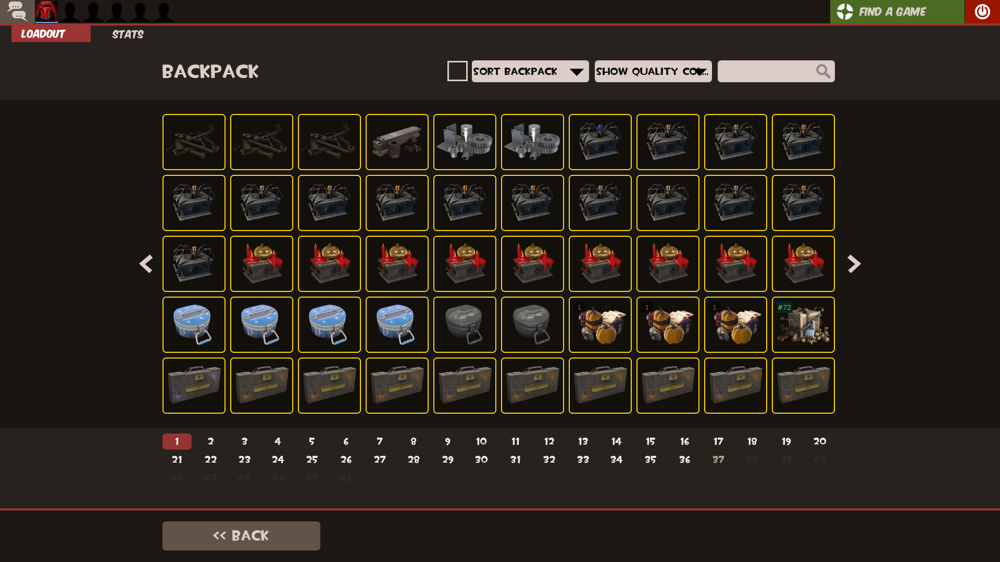
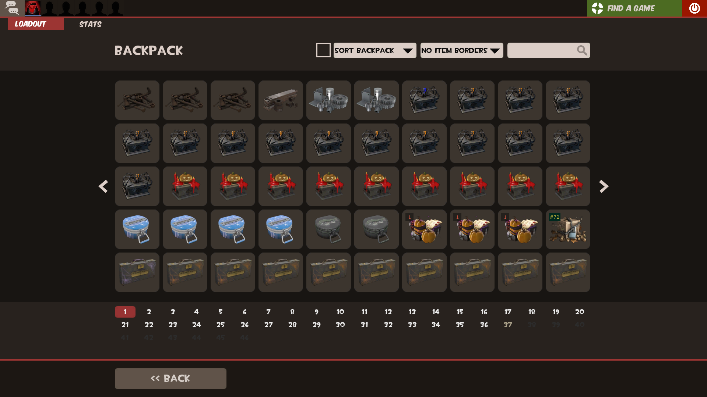
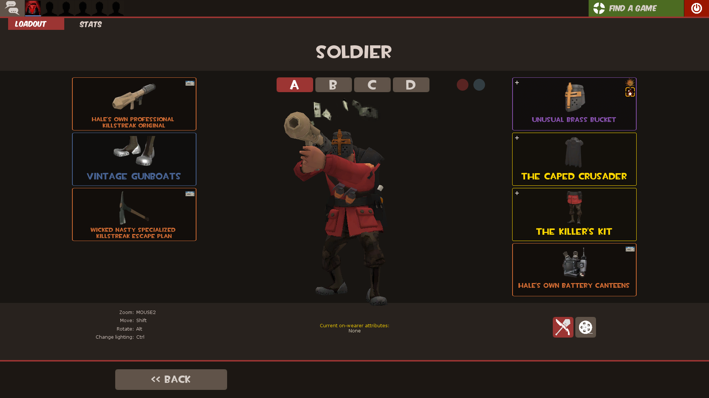
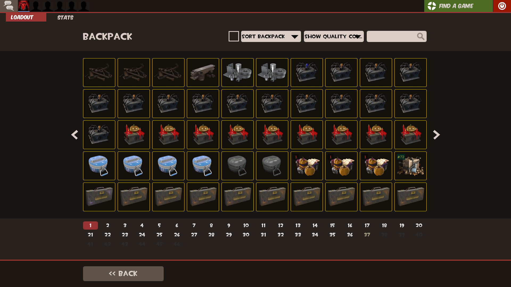
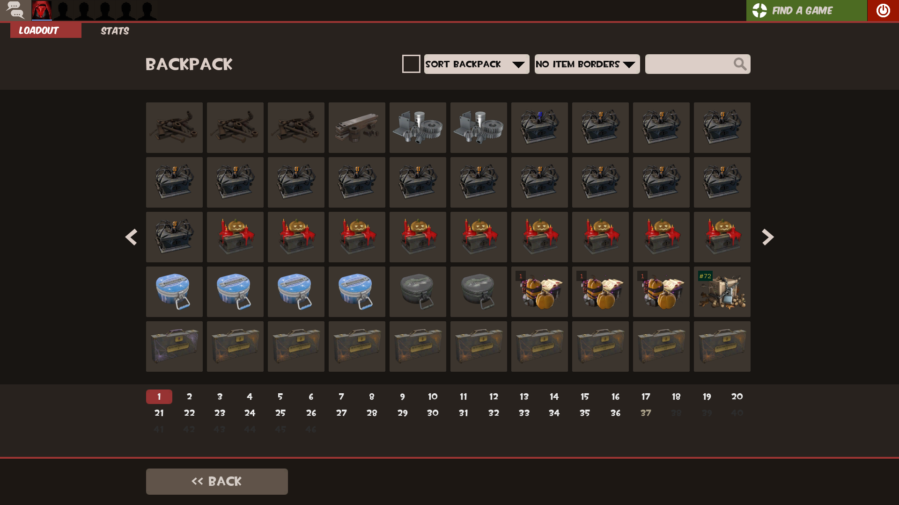

# ToonHUD Default Item Borders

A HUD modification for ToonHUD that replaces the item quality borders with TF2's default item borders

[Original Reddit Post](https://www.reddit.com/r/tf2/comments/9t6lvo/toonhud_with_default_item_borders/)

### Installation

1. Download either the [Soft Corners](https://raw.githubusercontent.com/cooolbros/toonhud-default-item-borders/main/src/soft_corners/toonhud_default_item_borders.res) or [Hard Corners](https://raw.githubusercontent.com/cooolbros/toonhud-default-item-borders/main/src/hard_corners/toonhud_default_item_borders.res) .res file
2. Move the .res file to `toonhud/resource/`
3. Insert

```#base "toonhud_default_item_borders.res"```

at the top of `toonhud/resource/clientscheme.res`

### Screenshots

**Soft Corners**






**Hard Corners**





